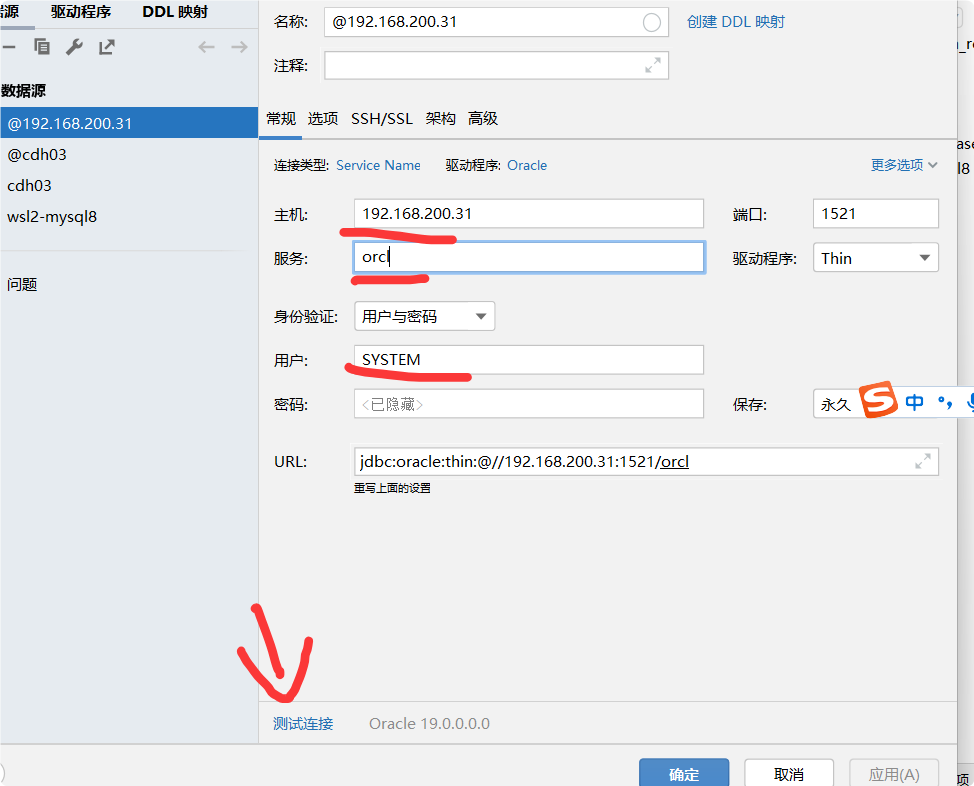
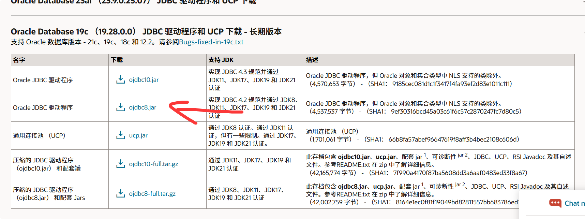
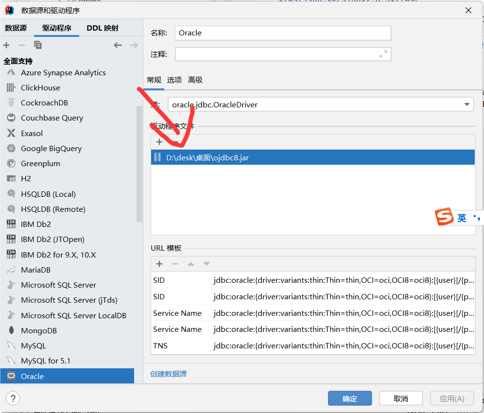

10月15日 韩天昊
# oracle 链接数据库

首先，在虚拟机上可以链接到oracle后
可以启动idea 来测试链接

但是，因为使用了外网还是无法下载oracle
驱动。所以使用ai软件，找到oracle官网手动下载

官网网址：https://www.oracle.com/database/technologies/appdev/jdbc-downloads.html

下载到桌面将jar包添加到驱动文件中，即可

